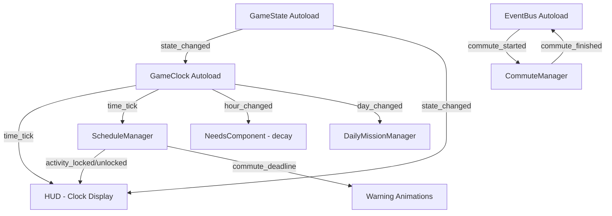

# F01 — Game Loop & Clock Design

**Spec**: `.specs/features/f01-game-loop-clock/spec.md`
**Status**: Draft

---

## Architecture Overview

O Game Clock é um **Autoload (singleton)** que emite sinais a cada tick. Todos os outros sistemas (HUD, schedule, needs, commute) escutam esses sinais. Isso desacopla o relógio de quem consome o tempo.



---

## Godot Project Structure

```
res://
├── autoloads/
│   ├── GameClock.gd          # Singleton — relógio global
│   ├── GameState.gd          # Singleton — FSM (PLAYING/PAUSED/COMMUTING/IN_MENU)
│   └── EventBus.gd           # Singleton — barramento de sinais global
├── scenes/
│   ├── main/
│   │   └── Main.tscn         # Scene raiz, carrega o mundo
│   ├── ui/
│   │   ├── HUD.tscn          # CanvasLayer: clock, bars, missions
│   │   ├── ClockDisplay.tscn # Label HH:MM + pulse animation
│   │   ├── WarningPopup.tscn # "⚠️ Hora de ir à escola!"
│   │   └── PauseOverlay.tscn # Overlay de pause
│   └── commute/
│       └── CommuteScene.tscn # Animação de ônibus/carro
├── scripts/
│   ├── clock/
│   │   ├── ScheduleManager.gd  # Gerencia janelas de atividade
│   │   └── CommuteManager.gd   # Gerencia commute + penalidades
│   └── data/
│       └── ScheduleData.gd     # Resource com horários
└── resources/
    ├── schedule_gritty.tres     # Horários do Gritty
    └── schedule_smartle.tres    # Horários do Smartle
```

---

## Components

### GameClock (Autoload)

- **Purpose**: Relógio global do jogo — avança tempo, emite sinais por minuto/hora/dia
- **Location**: `autoloads/GameClock.gd`
- **Interfaces**:
  - Signal `time_tick(hour: int, minute: int)` — a cada minuto de jogo
  - Signal `hour_changed(hour: int)` — a cada hora
  - Signal `day_changed(day: int)` — a cada novo dia
  - `set_speed(multiplier: float)` — 1.0 = normal, 2.0 = fast
  - `pause() / resume()` — controla pausa
  - `get_time_string() -> String` — retorna "HH:MM"
  - `get_total_minutes() -> int` — minutos desde 00:00 (para cálculos)
- **Dependencies**: Nenhuma
- **Pattern**: Accumulator em `_process(delta)`, não Timer node

```gdscript
extends Node

signal time_tick(hour: int, minute: int)
signal hour_changed(hour: int)
signal day_changed(day: int)
signal deadline_warning(character: String, minutes_left: int)

var game_minute: int = 0
var game_hour: int = 6    # dia começa às 06:00
var game_day: int = 1
var speed: float = 1.0    # 1 min jogo = 1 seg real
var is_paused: bool = false
var _accumulator: float = 0.0

func _process(delta: float) -> void:
    if is_paused:
        return
    _accumulator += delta * speed
    while _accumulator >= 1.0:
        _accumulator -= 1.0
        _advance_minute()

func _advance_minute() -> void:
    game_minute += 1
    if game_minute >= 60:
        game_minute = 0
        game_hour += 1
        if game_hour >= 24:
            game_hour = 0
            game_day += 1
            day_changed.emit(game_day)
        hour_changed.emit(game_hour)
    time_tick.emit(game_hour, game_minute)

func get_time_string() -> String:
    return "%02d:%02d" % [game_hour, game_minute]

func get_total_minutes() -> int:
    return game_hour * 60 + game_minute

func set_speed(multiplier: float) -> void:
    speed = multiplier

func pause() -> void:
    is_paused = true

func resume() -> void:
    is_paused = false
```

---

### GameState (Autoload)

- **Purpose**: FSM global — controla se o jogo está rodando, pausado, em commute, ou em menu
- **Location**: `autoloads/GameState.gd`
- **Interfaces**:
  - Signal `state_changed(old_state: State, new_state: State)`
  - `change_state(new_state: State)`
  - `current_state: State` (readonly)
- **Dependencies**: GameClock (pausa/resume)

```gdscript
extends Node

enum State { PLAYING, PAUSED, COMMUTING, IN_MENU }

signal state_changed(old_state: State, new_state: State)

var current_state: State = State.PLAYING

func change_state(new_state: State) -> void:
    if new_state == current_state:
        return
    var old = current_state
    current_state = new_state
    state_changed.emit(old, new_state)
    match new_state:
        State.PAUSED:
            GameClock.pause()
        State.PLAYING:
            GameClock.resume()
        State.COMMUTING:
            pass  # clock continua rodando durante commute
        State.IN_MENU:
            GameClock.pause()
```

---

### EventBus (Autoload)

- **Purpose**: Barramento de sinais para comunicação desacoplada entre sistemas
- **Location**: `autoloads/EventBus.gd`
- **Interfaces**:
  - Signal `commute_started(character: String, mode: String)`
  - Signal `commute_finished(character: String, late_minutes: int)`
  - Signal `activity_locked(activity: String, unlock_time: String)`
  - Signal `activity_unlocked(activity: String)`
  - Signal `warning_shown(message: String)`
  - Signal `day_started(day: int)`
  - Signal `day_ended(day: int)`

---

### ScheduleManager

- **Purpose**: Gerencia janelas de atividade — lock/unlock por horário, avisos de deadline
- **Location**: `scripts/clock/ScheduleManager.gd`
- **Interfaces**:
  - `is_activity_available(activity: String) -> bool`
  - `get_activity_window(activity: String) -> Dictionary` — {start: int, end: int}
  - `get_next_deadline(character: String) -> Dictionary` — {activity: String, minutes_left: int}
- **Dependencies**: GameClock (escuta `time_tick`)

```gdscript
extends Node

# Janelas de atividade (em minutos desde 00:00)
var schedule := {
    "english_class": {"start": 480, "end": 660},   # 08:00-11:00
    "cafeteria": {"start": 690, "end": 840},        # 11:30-14:00
    "sat_extra": {"start": 900, "end": 1020},       # 15:00-17:00
}

# Deadlines de commute (minuto em que DEVE sair de casa)
var commute_deadlines := {
    "gritty": {"leave_by": 435, "travel_time": 45},   # 07:15, 45min ônibus
    "smartle": {"leave_by": 465, "travel_time": 15},   # 07:45, 15min carro
}

func _ready() -> void:
    GameClock.time_tick.connect(_on_time_tick)

func _on_time_tick(hour: int, minute: int) -> void:
    var total = hour * 60 + minute
    _check_activities(total)
    _check_commute_deadlines(total)

func is_activity_available(activity: String) -> bool:
    var window = schedule.get(activity, null)
    if not window:
        return true  # atividades sem janela são sempre disponíveis
    var now = GameClock.get_total_minutes()
    return now >= window.start and now <= window.end

func _check_commute_deadlines(total_minutes: int) -> void:
    for character in commute_deadlines:
        var deadline = commute_deadlines[character]
        var minutes_left = deadline.leave_by - total_minutes
        if minutes_left == 15:
            GameClock.deadline_warning.emit(character, 15)
        elif minutes_left == 0:
            EventBus.warning_shown.emit("⚠️ Hora de ir à escola!")
```

---

### CommuteManager

- **Purpose**: Gerencia transição de commute — animação, avanço de tempo, penalidades por atraso
- **Location**: `scripts/clock/CommuteManager.gd`
- **Interfaces**:
  - `start_commute(character: String)` — inicia commute
  - Signal via EventBus: `commute_finished(character, late_minutes)`
- **Dependencies**: GameClock, GameState, ScheduleManager

**Lógica de penalidade por atraso:**
- Escola começa 08:00 (minuto 480)
- Tempo de chegada = minuto de saída + travel_time
- Se chegada > 480: late_minutes = chegada - 480
- Penalidade: a cada 5 min de atraso = -2 SAT (proporcional)

---

### ClockDisplay (UI)

- **Purpose**: Exibe HH:MM no HUD, com animação de pulse quando deadline se aproxima
- **Location**: `scenes/ui/ClockDisplay.tscn`
- **Node tree**:
  ```
  ClockDisplay (Control)
  ├── TimeLabel (Label)       # "07:15"
  ├── DayLabel (Label)        # "Dia 3"
  └── AnimationPlayer         # pulse_red animation
  ```
- **Dependencies**: GameClock (escuta `time_tick`, `day_changed`)

---

### WarningPopup (UI)

- **Purpose**: Exibe avisos animados ("⚠️ Hora de ir à escola!", penalidades)
- **Location**: `scenes/ui/WarningPopup.tscn`
- **Dependencies**: EventBus (escuta `warning_shown`)

---

## Data Models

### ScheduleData (Resource)

```gdscript
# scripts/data/ScheduleData.gd
extends Resource
class_name ScheduleData

@export var character_name: String
@export var commute_leave_time: int     # minuto de saída (ex: 435 = 07:15)
@export var commute_travel_time: int    # duração em minutos
@export var commute_mode: String        # "bus" ou "car"
@export var commute_energy_cost: float  # energia drenada no commute
@export var overnight_energy_recovery: float  # energia recuperada ao dormir
```

### ActivityWindow

```gdscript
# Inline dictionary — não precisa de Resource separado
# { "name": String, "start": int, "end": int, "locked_icon": "🔒" }
```

---

## Error Handling

| Cenário | Handling | Impacto no jogador |
| --- | --- | --- |
| Jogador tenta atividade fora do horário | Mostra 🔒 + janela de horário | Feedback visual claro |
| Clock chega a 00:00 sem dormir | Force-end day, -30% energia amanhã | Penalidade severa |
| Commute iniciado após deadline | Calcula atraso, aplica penalidade SAT | Texto na tela "-X SAT" |
| Switch de personagem durante commute | Commute continua em background | Outro personagem assume |

---

## Tech Decisions

| Decisão | Escolha | Razão |
| --- | --- | --- |
| Clock implementation | Accumulator em `_process` | Mais preciso que Timer, permite speed control |
| State management | Enum FSM no autoload | Simples, suficiente para 4 estados |
| Schedule data | Dictionary hardcoded | Poucos horários, não precisa de Resource |
| Communication pattern | EventBus + direct signals | EventBus para cross-system, direct para parent-child |
| Commute animation | Scene separada | Isola lógica de animação do mundo |

---

## Requirement Mapping

| Req ID | Component | Como é atendido |
| --- | --- | --- |
| CLK-01 | GameClock + ClockDisplay | Accumulator + Label com time_tick |
| CLK-02 | GameClock + Main | day_changed signal + stat resets |
| CLK-03 | ScheduleManager | Janelas com lock/unlock por total_minutes |
| CLK-04 | ScheduleManager + CommuteManager | Deadlines + penalidade proporcional |
| CLK-05 | GameClock.set_speed + Input | Space/+/- mapeados a speed control |
| CLK-06 | (futuro) CanvasModulate | Tints por período — P3, não implementado agora |
