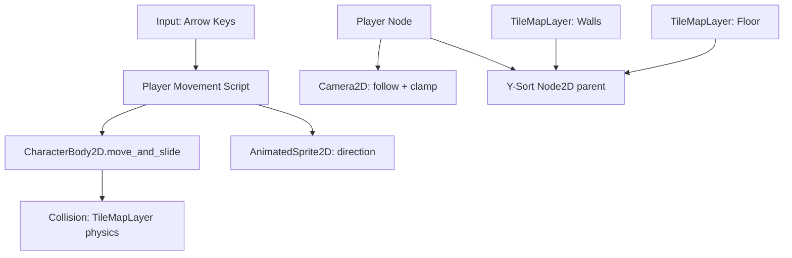

# F02 — Isometric World & Movement Design

**Spec**: `.specs/features/f02-isometric-movement/spec.md`
**Status**: Draft

---

## Architecture Overview



---

## Godot Isometric Setup

### Tile Configuration
- **Tile Shape**: Isometric
- **Tile Size**: 128x64 pixels (2:1 ratio — good detail for pixel art)
- **Tile Layout**: Diamond (standard isometric)
- **Y-Sort**: Enabled on parent Node2D so characters sort with objects

### Isometric Movement Mapping
Arrow keys map to isometric directions (rotated 45 degrees):
```
          UP (↑)
         ╱    ╲
   LEFT (←)    RIGHT (→)
         ╲    ╱
        DOWN (↓)

Isometric vectors (normalized):
  UP    → Vector2(1, -0.5)  → iso north-east
  DOWN  → Vector2(-1, 0.5)  → iso south-west
  LEFT  → Vector2(-1, -0.5) → iso north-west
  RIGHT → Vector2(1, 0.5)   → iso south-east
```

### TileMapLayer Setup (Godot 4.3+)
Three layers in the scene:
1. **GroundLayer** — floor tiles (no collision)
2. **WallsLayer** — walls + furniture (with collision polygons)
3. **Y-Sort parent** — contains WallsLayer + Player for correct depth

---

## Components

### TestRoom Scene

- **Purpose**: A simple isometric room for testing movement (will be replaced by real rooms in M2)
- **Location**: `scenes/world/TestRoom.tscn`
- **Node tree**:
  ```
  TestRoom (Node2D)
  ├── GroundLayer (TileMapLayer)     # Floor tiles, no collision
  └── YSortRoot (Node2D, y_sort_enabled=true)
      ├── WallsLayer (TileMapLayer)  # Walls + objects, with collision
      └── Player (CharacterBody2D)   # Injected or placed here
  ```

---

### Player Scene

- **Purpose**: Playable character with movement, collision, sprite, and camera
- **Location**: `scenes/characters/Player.tscn` + `scenes/characters/Player.gd`
- **Node tree**:
  ```
  Player (CharacterBody2D)
  ├── CollisionShape2D              # Capsule/circle for isometric footprint
  ├── Sprite2D                      # Character sprite (will be AnimatedSprite2D later)
  ├── Camera2D                      # Follows player, clamped to map edges
  └── InteractionArea (Area2D)      # For future F07 (detect nearby objects)
      └── CollisionShape2D
  ```
- **Interfaces**:
  - Arrow key input → isometric velocity
  - `move_and_slide()` for collision response
  - Camera2D with smoothing and limits

```gdscript
# Movement core logic
extends CharacterBody2D

@export var speed: float = 200.0

# Isometric direction vectors
const ISO_UP    = Vector2(1, -0.5)
const ISO_DOWN  = Vector2(-1, 0.5)
const ISO_LEFT  = Vector2(-1, -0.5)
const ISO_RIGHT = Vector2(1, 0.5)

func _physics_process(_delta: float) -> void:
    var direction := Vector2.ZERO
    if Input.is_action_pressed("move_up"):
        direction += ISO_UP
    if Input.is_action_pressed("move_down"):
        direction += ISO_DOWN
    if Input.is_action_pressed("move_left"):
        direction += ISO_LEFT
    if Input.is_action_pressed("move_right"):
        direction += ISO_RIGHT

    if direction != Vector2.ZERO:
        direction = direction.normalized()
    velocity = direction * speed
    move_and_slide()
```

---

### TileSet Resource

- **Purpose**: Shared tileset with floor and wall tiles, including collision shapes for walls
- **Location**: `resources/isometric_tileset.tres`
- **Tile size**: 128x64
- **Physics layer**: Layer 0 for wall collision polygons
- **Tile sources**: 
  - Placeholder colored tiles (will be replaced with pixel art)
  - Floor: flat color tile (walkable)
  - Wall: darker tile with collision polygon

---

### Camera2D Setup

- **Purpose**: Follow player with smoothing, clamp to map boundaries
- **Location**: Inside `Player.tscn`
- **Config**:
  - `position_smoothing_enabled = true`
  - `position_smoothing_speed = 5.0`
  - `limit_left/right/top/bottom` set to map boundaries
  - `drag_horizontal_enabled = true` (slight camera lag for feel)

---

## Data Models

No new data models for this feature. Movement is purely real-time physics.

---

## Error Handling

| Scenario | Handling | Player Impact |
| --- | --- | --- |
| Character stuck in wall (bad collision) | move_and_slide handles sliding | Character slides along wall |
| Camera beyond map edge | Camera2D limits clamp | No empty space visible |
| Movement during pause | GameState check in _physics_process | Input ignored |

---

## Tech Decisions

| Decision | Choice | Rationale |
| --- | --- | --- |
| Tile size | 128x64 | Good detail for pixel art, standard 2:1 isometric ratio |
| Movement style | Smooth (not tile-snap) | Feels better for a Sims-like game, more modern |
| Collision | TileMapLayer physics layer | Built-in Godot, no custom code needed |
| Y-Sort | Node2D y_sort_enabled | Godot native, automatic depth sorting |
| Camera | Camera2D on Player | Simplest approach, built-in smoothing and limits |
| Sprite | Sprite2D (placeholder) | AnimatedSprite2D in P2 task, start simple |

---

## Requirement Mapping

| Req ID | Component | How |
| --- | --- | --- |
| MOV-01 | TestRoom + TileSet | TileMapLayer with isometric tiles |
| MOV-02 | Player.gd | Arrow keys → iso vectors → move_and_slide |
| MOV-03 | TileSet physics layer + CharacterBody2D | Collision polygons on wall tiles |
| MOV-04 | YSortRoot (Node2D) | y_sort_enabled = true on parent |
| MOV-05 | Camera2D on Player | Smoothing + limits |
| MOV-06 | AnimatedSprite2D (future) | P2, not in initial implementation |
