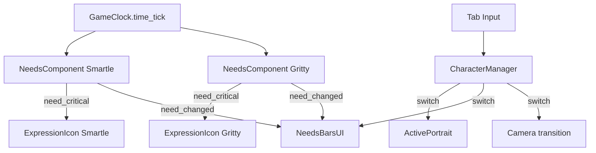

# F03 — Character System Design

**Spec**: `.specs/features/f03-character-system/spec.md`
**Status**: Draft

---

## Architecture Overview



---

## Components

### NeedsComponent (Reusable Node)

- **Purpose**: Manages hunger/energy/fun for one character. Decays per tick, emits signals.
- **Location**: `scripts/components/NeedsComponent.gd`
- **Attached to**: Each Player instance as child node

```gdscript
# Core data structure
var needs := {
    "hunger": 50.0,
    "energy": 45.0,
    "fun": 60.0,
}
var sat_score: int = 0
const SAT_TARGET := 1600

# Decay rates per game minute
var decay_rates := {
    "hunger": 0.15,
    "energy": 0.1,
    "fun": 0.08,
}

# Signals
signal need_changed(need_name: String, value: float, max_value: float)
signal need_critical(need_name: String, value: float)
signal sat_changed(score: int, target: int)
```

**Compound mechanic**: When hunger < 40, energy decay doubles. When hunger < 20, triples.

---

### CharacterManager (Autoload)

- **Purpose**: Tracks both characters, handles switching, routes signals
- **Location**: `autoloads/CharacterManager.gd`
- **Interfaces**:
  - `switch_character()` — toggle active
  - `get_active_player() -> CharacterBody2D`
  - `get_inactive_player() -> CharacterBody2D`
  - Signal `character_switched(active_name: String)`

---

### NeedsBarsUI

- **Purpose**: HUD panel showing 3 needs bars + SAT bar for active character
- **Location**: `scenes/ui/NeedsBars.tscn` + `.gd`
- **Node tree**:
  ```
  NeedsBars (VBoxContainer)
  ├── HungerBar (TextureProgressBar or ProgressBar)
  ├── EnergyBar (ProgressBar)
  ├── FunBar (ProgressBar)
  └── SATBar (ProgressBar)
  ```

**Color logic**:
- value > 50: green (#4CAF50)
- value 20-50: yellow (#FFC107)
- value < 20: red (#F44336)
- SAT: always blue (#2196F3)

---

### ExpressionIcon

- **Purpose**: Floating emoji/icon above character head based on most critical need
- **Location**: `scripts/components/ExpressionIcon.gd`
- **Attached to**: Each Player as child Label node

**Priority** (lowest need wins):
1. energy < 20: "✖✖" (exhausted)
2. hunger < 20: "💧" (starving)
3. energy < 40: "😪" (tired)
4. hunger < 40: "😟" (hungry)
5. fun < 30: "😑" (bored)
6. all > 50: "😊" (happy)
7. otherwise: no icon

Float animation: gentle bobbing via Tween.

---

### ActivePortrait

- **Purpose**: Small portrait in HUD corner showing which character is active
- **Location**: Inside NeedsBars or as sibling — `scenes/ui/ActivePortrait.tscn`

---

## Data Models

### CharacterData (Resource)

```gdscript
# scripts/data/CharacterData.gd
extends Resource
class_name CharacterData

@export var character_name: String
@export var display_name: String
@export var sprite_texture: Texture2D
@export var starting_hunger: float = 50.0
@export var starting_energy: float = 45.0
@export var starting_fun: float = 60.0
@export var overnight_recovery: float = 50.0
```

Two instances: `gritty_data.tres` and `smartle_data.tres`

---

## Input Mapping

Add to project.godot:
```
switch_character → Tab key
```

---

## Tech Decisions

| Decision | Choice | Rationale |
| --- | --- | --- |
| Needs as component | Child Node script | Reusable, each character gets own instance |
| CharacterManager | Autoload | Needs to persist, accessed by UI and systems |
| Expression icons | Label with emoji text | Simple, no sprite sheets needed, cross-platform |
| Bar colors | ProgressBar with stylebox override | Built-in Godot, no custom rendering |
| Character data | Resource files | Inspector-editable, easy to tune values |

---

## Requirement Mapping

| Req ID | Component | How |
| --- | --- | --- |
| CHR-01 | NeedsComponent | Decay per tick, compound hunger→energy |
| CHR-02 | NeedsBarsUI | ProgressBars with color thresholds |
| CHR-03 | CharacterManager | Tab switch, camera transition |
| CHR-04 | ExpressionIcon | Priority-based emoji Label |
| CHR-05 | NeedsBarsUI.SATBar | Blue ProgressBar, score/target display |
