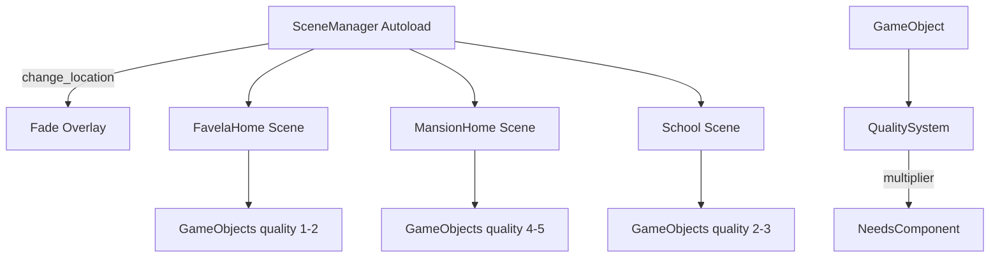

# F04-F06 — World Building Design

**Spec**: `.specs/features/f04-f06-world-building/spec.md`
**Status**: Draft

---

## Architecture Overview



---

## Location Specs

| Location | Size | Floor Color | Wall Color | Object Quality |
| --- | --- | --- | --- | --- |
| Favela | 8x8 | Dark brown | Red-brown brick | ★☆-★★ (1-2) |
| Mansion | 14x14 | White marble | Light pink | ★★★★-★★★★★ (4-5) |
| School | 12x10 | Wood tone | Beige | ★★-★★★ (2-3) |

---

## Components

### SceneManager (Autoload)

- **Purpose**: Handles location transitions with fade animation
- **Location**: `autoloads/SceneManager.gd`
- **Interfaces**:
  - `change_location(location_name: String, character: String)`
  - `get_current_location(character: String) -> String`
  - Signal `location_changed(character: String, location: String)`

```
Locations: "favela", "mansion", "school"
```

Each location is a PackedScene. SceneManager swaps the World child in Main.

---

### GameObject (Base)

- **Purpose**: Interactive object in a room with quality, name, and effect
- **Location**: `scripts/components/GameObject.gd`
- **Properties**:
  - `object_name: String`
  - `quality: int` (1-5)
  - `action_name: String` (e.g., "Dormir", "Comer")
  - `need_affected: String` (e.g., "energy", "hunger")
  - `base_restore: float` (base amount restored)
  - `time_cost: int` (game minutes to use)

**Quality multipliers**:
```
1 star  → 0.50x
2 stars → 0.75x
3 stars → 1.00x
4 stars → 1.30x
5 stars → 1.60x
```

---

### QualityLabel

- **Purpose**: Shows ★ rating below object name
- **Location**: Part of GameObject — Label child node

---

### Location Scenes

Each location scene follows the same structure as TestRoom:

```
[Location] (Node2D)
├── GroundLayer (TileMapLayer)
└── YSortRoot (Node2D, y_sort_enabled)
    ├── WallsLayer (TileMapLayer)
    ├── GameObject "Bed" (StaticBody2D)
    │   ├── Sprite2D (placeholder colored rect)
    │   ├── CollisionShape2D
    │   └── QualityLabel (Label: "★★☆☆☆")
    ├── GameObject "Stove" (StaticBody2D)
    │   └── ...
    └── [Player injected here by SceneManager]
```

GameObjects use StaticBody2D (not tiles) for individual collision and interaction detection.

---

### TileSetFactory Update

Add per-location tile colors:

```gdscript
static func create_tileset_for(location: String) -> TileSet:
    match location:
        "favela": floor=brown, wall=red-brick
        "mansion": floor=white, wall=pink
        "school": floor=wood, wall=beige
```

---

## Data Models

### GameObjectData

```gdscript
# Inline dictionary — no Resource needed
{
    "name": "Cama Velha",
    "quality": 1,
    "action": "Dormir",
    "need": "energy",
    "base_restore": 40.0,
    "time_cost": 120,  # 2 hours
    "tile_pos": Vector2i(2, 2),
}
```

### Location Object Lists

**Favela** (quality 1-2):
| Object | Quality | Need | Base Restore | Time |
| --- | --- | --- | --- | --- |
| Cama Velha | ★☆☆☆☆ | energy | 40 | 120min |
| Fogao Basico | ★★☆☆☆ | hunger | 30 | 30min |
| TV Antiga | ★☆☆☆☆ | fun | 25 | 60min |
| Mesa Simples | ★☆☆☆☆ | (study) | - | - |
| Geladeira Velha | ★☆☆☆☆ | hunger | 15 | 10min |

**Mansion** (quality 4-5):
| Object | Quality | Need | Base Restore | Time |
| --- | --- | --- | --- | --- |
| Cama King | ★★★★★ | energy | 40 | 120min |
| Cozinha Gourmet | ★★★★☆ | hunger | 30 | 30min |
| Setup Gamer | ★★★★★ | fun | 25 | 60min |
| Tutor Particular | ★★★★★ | (study) | - | - |
| Academia | ★★★★☆ | energy | 20 | 45min |

**School** (quality 2-3):
| Object | Quality | Need | Base Restore | Time |
| --- | --- | --- | --- | --- |
| Carteira Escolar | ★★★☆☆ | (study) | - | - |
| Cantina | ★★☆☆☆ | hunger | 25 | 30min |
| Biblioteca | ★★★☆☆ | (study) | - | - |
| Mesa do Professor | ★★★☆☆ | (interact) | - | - |

---

## Tech Decisions

| Decision | Choice | Rationale |
| --- | --- | --- |
| Scene management | Swap World child in Main | Simpler than Godot scene tree change, keeps HUD |
| Objects | StaticBody2D (not tiles) | Need individual collision, interaction, quality label |
| Transition | CanvasLayer fade overlay | Clean, simple, reusable |
| Tile colors | Per-location TileSetFactory | Same system, different palette |
| Object data | Inline dictionaries | Few objects, no need for Resource files |

---

## Requirement Mapping

| Req ID | Component | How |
| --- | --- | --- |
| WLD-01 | FavelaHome scene | 8x8 room, brown tiles, 5 objects quality 1-2 |
| WLD-02 | MansionHome scene | 14x14 room, pink tiles, 5 objects quality 4-5 |
| WLD-03 | School scene | 12x10 room, wood tiles, 4 objects quality 2-3 |
| WLD-04 | SceneManager | Fade transition, location swap in Main |
| WLD-05 | GameObject + quality multiplier | Stars label + restore calculation |
