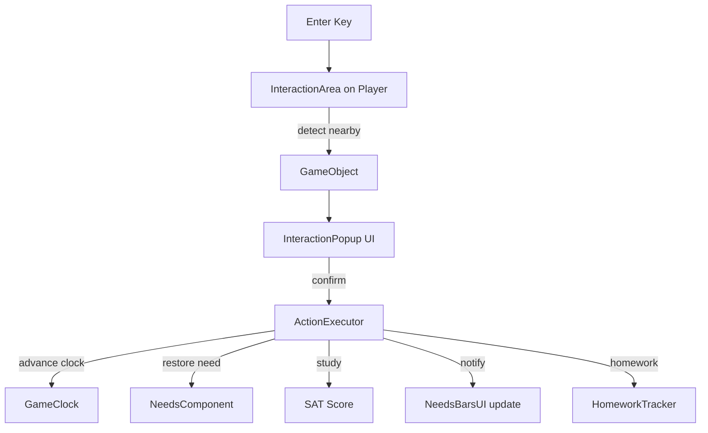

# F07-F09 — Interaction & Mechanics Design

**Spec**: `.specs/features/f07-f09-interaction-mechanics/spec.md`
**Status**: Draft

---

## Architecture Overview



---

## Components

### InteractionArea (on Player)

Already exists as Area2D child in Player.tscn. Needs script to detect nearby GameObjects.

- **Purpose**: Detects GameObjects within interaction range
- **Location**: `scripts/components/InteractionDetector.gd` (attached to Area2D)
- **Range**: Circle radius ~60px (about 1 tile)
- **Interface**: `get_nearest_object() -> GameObject`

---

### InteractionPopup (UI)

- **Purpose**: Shows object info and action button when Enter is pressed near an object
- **Location**: `scenes/ui/InteractionPopup.tscn` + `.gd`
- **Shows**: Object name, quality stars, action name, time cost, expected restore
- **Buttons**: "Confirmar" / "Cancelar" (or just Enter to confirm, Esc to cancel)
- **Node tree**:
  ```
  InteractionPopup (PanelContainer)
  ├── VBoxContainer
  │   ├── ObjectNameLabel
  │   ├── QualityLabel (★★★☆☆)
  │   ├── ActionLabel ("Dormir — 2h")
  │   ├── RestoreLabel ("+20 ⚡ Energia")
  │   └── HintLabel ("[Enter] Confirmar  [Esc] Cancelar")
  ```

---

### ActionExecutor

- **Purpose**: Executes an action: advances clock, restores need, updates SAT, shows feedback
- **Location**: `scripts/components/ActionExecutor.gd` (attached to Player or as child)
- **Interface**: `execute_action(object: GameObject, needs: NeedsComponent)`
- **Flow**:
  1. Disable player movement
  2. Show "using..." feedback
  3. Advance clock by time_cost minutes
  4. Calculate restore: `base_restore × quality_multiplier`
  5. Apply to NeedsComponent
  6. If study object: add SAT points
  7. Show result notification ("+X ⚡")
  8. Re-enable movement

---

### HomeworkTracker

- **Purpose**: Tracks if each character did homework today
- **Location**: Part of NeedsComponent (add `homework_done: bool`)
- **Logic**: Study at home desk → homework_done = true. Day end → if !homework_done → -5 SAT.

---

### RestoreNotification (UI)

- **Purpose**: Brief floating "+20 ⚡" text that fades out after action
- **Location**: Reuse WarningPopup or create small Label tween in Player

---

### DialogueBox (UI)

- **Purpose**: Simple text box for Brighta NPC dialogue
- **Location**: `scenes/ui/DialogueBox.tscn` + `.gd`
- **Shows**: Speaker name + text. Enter to dismiss.

---

## Tech Decisions

| Decision | Choice | Rationale |
| --- | --- | --- |
| Interaction detection | Area2D overlaps | Built-in Godot, reliable |
| Popup style | PanelContainer | Simple, consistent UI |
| Action execution | Instant clock advance | Simpler than real-time waiting |
| Homework tracking | Bool on NeedsComponent | Simple, one flag per character |
| Dialogue | Static text array | Few lines, no need for dialogue system |

---

## Requirement Mapping

| Req ID | Component | How |
| --- | --- | --- |
| INT-01 | InteractionDetector + InteractionPopup | Area2D detect + popup on Enter |
| INT-02 | ActionExecutor | Clock advance + need restore + movement lock |
| INT-03 | GameObject.get_restore_amount() | Quality multiplier already implemented |
| INT-04 | ActionExecutor study branch | SAT += 10 × quality_multiplier |
| INT-05 | HomeworkTracker in NeedsComponent | homework_done flag + day-end penalty |
| INT-06 | DialogueBox + Brighta Area2D | Enter near Brighta → dialogue |
